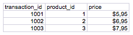
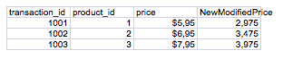

# ExcelAutomation
The project changes de value of a whole column by multiplying each column value by a constant, this can be usefull when you want to change a value of a huge amount of data on the same ratio.

## Usage

When the program starts, It shows all the files and folders where the main.py is located.
```console
1 - transactions.xlsx
2 - transactions2.xlsx
3 - __pycache__
4 - README.md
5 - functions
6 - venv
7 - .vscode
8 - main.py
9 - .idea
----------------------------------
Select a number file or folder:
```
When you select an excel file, it shows a confirmation message.
```console
Is ./transactions.xlsx the excel archive you want to modify? Y/N 
```
After that it demands information to make the modification: column you want to modify, new data column and if you want to make a barchart. 
```console
Column you want to edit: 
```

```console
New data column:
```
```console
Column name: 
```
```console
Do you want to make a chart? Y/N
```

If you enter on a folder, and option to go back displays at the end.
```console
1 - bin
2 - include
3 - pyvenv.cfg
4 - lib
5 - ️⬅️ Go back
----------------------------------
Select a number file or folder: 
```

# Visuals
Excel Sheet before modification.



Excel Sheet after modification.

